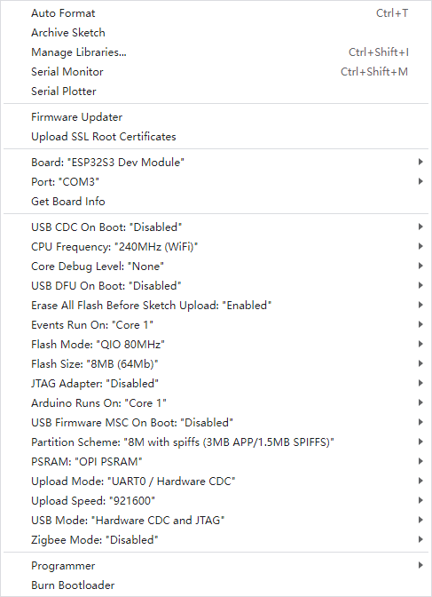

# a_blink_test.md – Blink Test Exercise

## 🔧 Objective
Make sure your ESP32-S3 board is working correctly by:
- Connecting it to your computer
- Uploading the `blink.ino` program
- Seeing it blink an LED
- Reading personalized messages in the Serial Monitor
- Pressing the reset button to restart the program

---

## 🛠️ Arduino IDE Settings (Lab Workstations)
Use these exact settings to match your lab desktop environment:

| Setting                     | Value                          |
|----------------------------|---------------------------------|
| **Board**                  | `ESP32S3 Dev Module`           |
| **Port**                   | `COMx` via **usbserial**       |
| **CPU Frequency**          | `240MHz (WiFi)`                |
| **Flash Size**             | `8MB (64Mb)`                   |
| **PSRAM**                  | `OPI PSRAM`                    |
| **Upload Mode**            | `UART0 / Hardware CDC`         |
| **Upload Speed**           | `921600`                       |
| **Partition Scheme**       | `8MB with spiffs`              |
| **Erase Flash Before Upload** | `Enabled`                  |
| **Serial Monitor Baud Rate** | `115200`                    |



---

## 📂 File to Open
```
0-Basics/
└── blink.ino
```

---

## ✅ Steps to Complete

1. **Plug in your ESP32-S3 board**  
   Use the USB-C cable to connect it to your lab computer.

2. **Open `blink.ino` in Arduino IDE**

3. **Set your Username**  
   Find the line:
   ```cpp
   String username = "your_name_here";
   ```
   Change it to your name, like:
   ```cpp
   String username = "Jordan";
   ```

4. **Set Arduino Board & Port**  
   - Tools → Board → `ESP32S3 Dev Module`  
   - Tools → Port → `COMx` (usbserial device)

5. **Upload the Code**  
   Click the ▶️ Upload button. Wait for "Done uploading."

6. **Open Serial Monitor**  
   Tools → Serial Monitor → Set baud to `115200`  
   You should see:
   ```
   💡 Artemis Lab 1: Blink Test
   👋 Hello, Jordan!
   ✅ Your ESP32-S3 is working and the LED is blinking.
   ```

7. **Watch the LED Blink**  
   It will turn on/off every second.

8. **Press Reset Safely**  
   Use the **EN** (reset) button to restart the program.  
   ✅ Tip: You can use the **rubber end of a pencil** — it’s safe and won’t damage the board!

9. **Clear the Board (Optional)**  
   Load an empty sketch to clear the board completely.  
   👉 File: `esp/clear_board.ino` (or check the **helpers** folder)

---

## 🧪 Troubleshooting
- Serial Monitor shows nothing? → Check your COM port + baud = `115200`
- Upload fails? Try holding BOOT while clicking upload, then release.
- No blinking? Check if LED is on a different GPIO (e.g., 10 or 2)
- Did the program start running *before* Arduino IDE said "Done uploading"?  
  👉 That’s normal! The ESP32 reboots quickly once flashed — even before the IDE finishes updating the status.

---

## ✅ Success Checklist
- [ ] Board connected
- [ ] Username edited
- [ ] Code uploaded
- [ ] LED is blinking
- [ ] Welcome message appears in Serial Monitor
- [ ] Reset button restarts the program

You're ready to move on to **servo control, stepper motors, or FSM labs**! 🧠💡

Next file: `b_servo_stepper_test.ino` lets you:
- Test **GPIO servo**, **PCA9685 servo**, or a **stepper motor**
- Select hardware via `test_mode = 1, 2, or 3`
- Print output to Serial Monitor so you know what’s active

Run this after `a_blink_test.ino` to validate motor connections!
